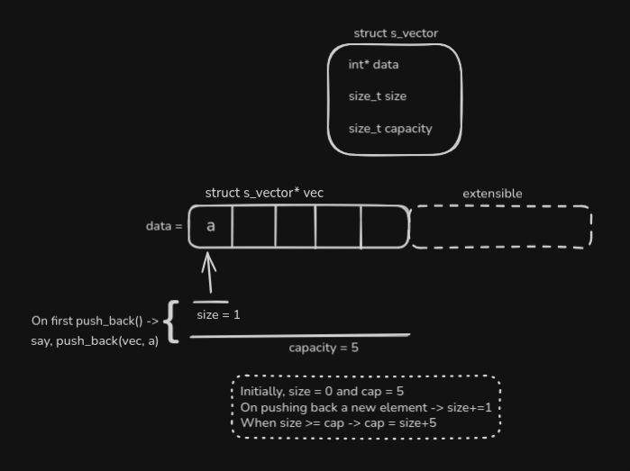
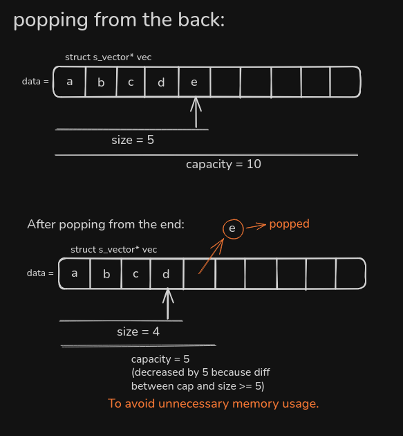

# s-vector

Writing a minimal implementation of a dynamic array in C, inspired by C++ STL's `std::vector`.

> This project is part of my effort to get more comfortable with low-level programming in C.
> I really enjoy working with C (and C++) for the level of control they provide over memory and performance. Before making more complex stuff like a custom memory allocator (`s-memalloc`, which is ongoing actually, but I felt the need to warm up a bit before continuing), I’m starting with smaller components to strengthen my understanding of memory management and data structures.
> While I’ve implemented data structures in C while learning data structures and algorithms for the first time and for further practice, I haven’t built standalone C projects before. This is the first step I’m taking to change that.

---

## Design

> Integer-only for now, for the sake of simplicity.

### Insertion (at the end)

### Deletion (from the end)

---

## Naming

All the functions use the `sv_` prefix (e.g., `sv_init`, `sv_push_back`, `sv_pop_back`, `sv_free`).  
`sv` stands for **s-vector**.

**Why a prefix?**  
Since C has no namespaces, a generic name like `push_back` (like C++'s `std::vector`) could collide with other libraries or my future programs.

So, the prefix:
- Avoids any conflicts.
- Makes the functions' duty obvious (as they work on my `s_vector`).

---

## Author

Saptaparno Chakraborty

---
